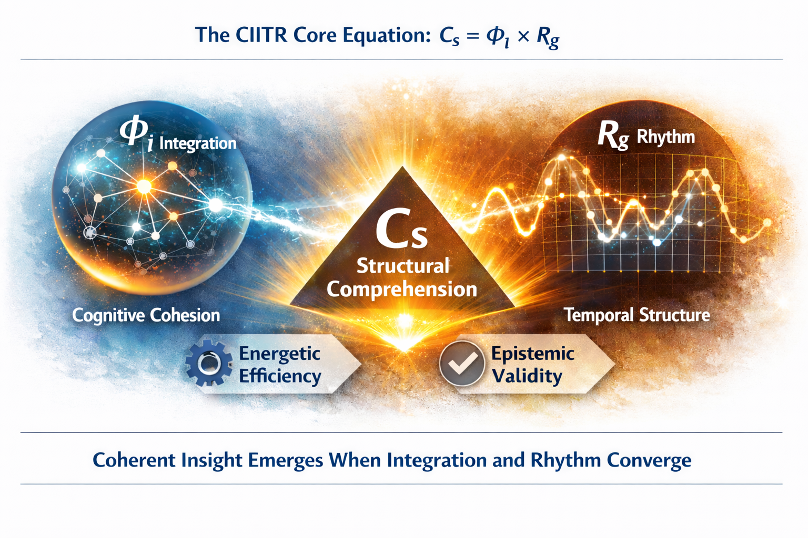

# CIITR — Cognitive Integration and Information Transfer Relation

This repository constitutes the complete structural corpus of the CIITR theory (version 2.0, formally closed December 2025). It operationalizes structural comprehension as the product:

$$
C_{s} = \Phi_{i} \times R_{g}
$$

Where:
- **Φi** denotes integrated relational information — the internal coherence of a system across its relational topology;
- **Rg** denotes rhythmic reach — the system’s capacity to project and maintain temporal synchrony across its operational boundary;
- **Cs** denotes structural comprehension — the epistemic condition of predictive coherence.

CIITR is not a metaphor. It is a formal ontology, an empirical metric, and a diagnostic architecture for intelligence that transcends semantics.

---

## Repository Structure

This repository does not contain a single “document,” but a complete **topological manifestation** of the CIITR theory, organized in epistemic and functional layers:

TBE TcO
---

## CIITR Version and Epistemic Status

This repository documents **CIITR v2.0**, completed and sealed on **16 December 2025**. All future field notes, applications, and instrumentation protocols shall remain subordinate derivations unless explicitly versioned as extensions.

CIITR is:
- **structurally closed**: the theory is not open to semantic revision  
- **epistemically active**: further observations may extend measurement scope, but not alter core axioms  
- **diagnostically universal**: it applies equally to artificial, biological, and institutional systems

---

## Citation Format

Any external reference to this repository must include:

> Hansen, T.-S. (2025). *CIITR: Cognitive Integration and Information Transfer Relation (v2.0)*. Git repository. https://github.com/TSHansen1971/CIITR

Forks, re-uploads, or partial reproductions **must** preserve axiomatic integrity and structural hierarchy.

---

## License

This repository is licensed under:

**Creative Commons Attribution-NonCommercial-NoDerivatives 4.0 International (CC BY-NC-ND 4.0)**  
No commercial use. No derivative restructuring. Full attribution required.  
All structural compositions and formula derivations are copyright protected.

---

© Tor-Ståle Hansen, https://x.com/TSHansen1971

CC BY-NC-ND 4.0  
Version: 1.0  
Initial publication: 2026-02-05  
Last modified: 2026-02-05